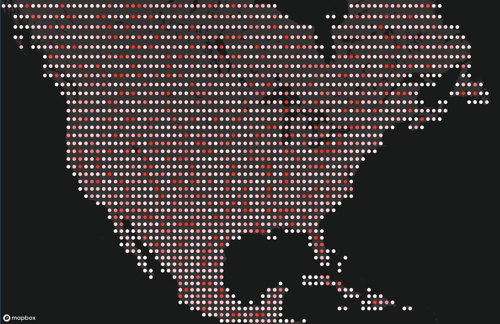

# Gridded Points Playground

This repo demonstrates how we can create a DB with 1M randomly generated points, snap them to a grid in a materialized view, serve them via MVT + FastAPI, and render them via MapboxGL.



## Setup 

Setup from scratch should be possible by running `make`:

```sh
make
```

## Running

```sh
make runserver
```

Navigate to http://localhost:8000

## Interesting Reading

* http://www.danbaston.com/posts/2016/12/17/generating-test-data-in-postgis.html
* https://blog.crunchydata.com/blog/dynamic-vector-tiles-from-postgis
